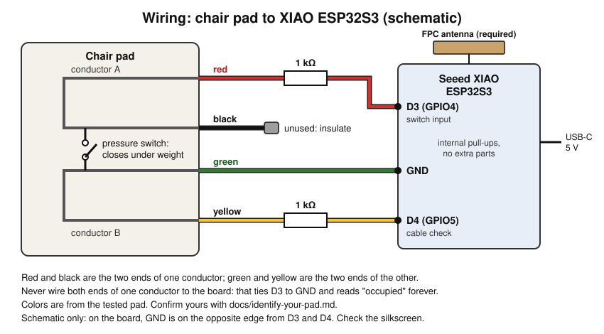

# Identify your pad's wires

Do this before soldering anything. Guessing the wire pair is the most common way to end up with a sensor that reads "occupied" forever.

## What you are looking for

Chair alarm pads are membrane switches: two conductive layers that touch when someone sits. Many pads, including the tested one, run **each layer out and back on two wires** so the original alarm can check the cable is intact. That gives four wires in two loops:

| Pair | Empty pad | Someone sitting |
| --- | --- | --- |
| Both ends of layer A (tested pad: red + black) | about 0 Ω, always | about 0 Ω |
| Both ends of layer B (tested pad: green + yellow) | about 0 Ω, always | about 0 Ω |
| One wire from A, one from B (any cross pair) | open | low, tens of ohms up to a few kΩ |

The switch is the **cross pair**. The two same-layer pairs are not switches at all: they are shorts. Wiring one across D3 and GND ties the pin to ground permanently.

## Measure hands-free

Holding meter probes on thin stranded wire gives false readings: a probe that slips reads "open", which looks exactly like an open switch. Removing your hands from the measurement fixes that.

1. Cut off the pad's plug. Strip about 5 mm of each wire and twist the strands.
2. Solder or twist each pad wire onto a short solid-core jumper, and plug each into its own row of a breadboard.
3. Wrap a solid-core jumper tightly around each meter probe tip and plug those into the rows you want to measure.
4. Meter on resistance. A manual-range meter on the 20k range works well; `1` or `OL` means open.

Now measure every pair (four wires make six pairs), first with the pad empty, then pressing firmly on it or sitting on it. Write both readings down.

## Reading the results

- **Two pairs at 0 Ω empty, cross pairs open empty and low when pressed:** the looped pad above. Wire one end of layer A to D3 and the other end of layer B to D4, each through a 1 kΩ resistor, and one end of layer B to GND. D4 is the cable-break check. The fourth wire is unused.
- **Only two wires, open empty and low when pressed:** a plain switch pad. Wire one to D3 (through the resistor) and the other to GND. Then connect **D4 directly to GND** with a short wire, or the cable check will report a problem forever. Cable-break detection is not available with this pad.
- **A cross pair is low when empty and opens when pressed:** a normally closed pad. It will work, but in the generated ESPHome file change `inverted: true` to `inverted: false` under the `Pad Raw` pin.
- **Pressed reading above about 10 kΩ:** the pad is too resistive for the board's internal pull-up to read reliably. It needs a different design (an analog threshold), which this project does not cover yet.
- **Nothing changes when pressed:** press harder, or across a wider area. Membrane pads need real weight. If still nothing, the pad may be faulty.

## Tested pad, for reference

Replacement 10in x 15in Chair Sensor Pad by Smart Caregiver, UPC 812293010372 ([Amazon B01N0P2J6X](https://www.amazon.com/dp/B01N0P2J6X)), made for their TL-2100 series monitors:

- Red + black and green + yellow are the two loops.
- Red to green reads about 40 to 60 Ω under hand pressure, open when empty.
