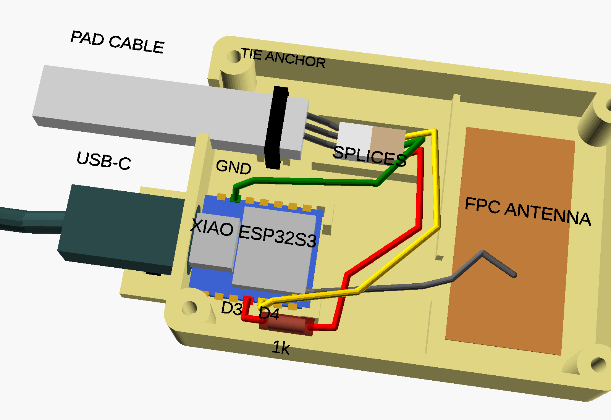

# Enclosure

A small PLA case for the XIAO ESP32S3, its FPC antenna, and the pad cable splices, with strain relief for both cables. About 75 x 54 x 15 mm plus a 10 mm tab for the USB cable.

| File | What |
| --- | --- |
| `base.stl` | Base. Print open side up. |
| `lid.stl` | Lid. Already flipped: prints top face down. |
| `test.stl` | Just the USB-C end of the base, for a quick fit check of your USB cable's plug. |
| `recliner_enclosure.scad` | OpenSCAD source for all of the above. |

The STLs are the exact files printed and fitted for the tested build.

## Printing

- PLA, 0.2 mm layers, no supports.
- 3 walls and 20 % infill are plenty.
- About 25 g of filament for base and lid.
- Four M3 x 8 or x 10 self-tapping screws hold the lid. Drive them until just snug.

## What is inside



- **Board bay:** the XIAO sits on a raised platform on foam tape, located by two corner stops at the antenna end, with room along both edges for wires.
- **USB-C:** a 12.5 x 7.5 mm opening sized for a cable's plug overmold, and an outside tab with two zip tie slots so a tug on the cable never reaches the board.
- **Pad cable:** an open-top notch in the end wall. Inside, a zip tie through a tunnel under a raised block grips the cable jacket, and a tongue on the lid presses lightly on the cable.
- **Splice area:** between two low rails, room for the three soldered splices (or a JST connector pair, if you prefer one).
- **Antenna bay:** the FPC antenna sticks flat to the floor, past a low divider with a gap for the coax.

## Adjusting

Open `recliner_enclosure.scad` in OpenSCAD. The `part` variable picks the view:

| `part` | Shows |
| --- | --- |
| `layout` (default) | The base with stand-in board, antenna, cables and wiring. Preview only (F5); rendering (F6) falls back to the base. |
| `assembly` | Base and lid together |
| `base`, `lid`, `test` | The printable parts |

Export a part from the command line:

```
openscad -D 'part="base"' -o base.stl recliner_enclosure.scad
```

Values you are most likely to change:

| Variable | Default | When to change |
| --- | --- | --- |
| `cable_w`, `cable_t` | 10, 5 mm | Your pad cable's width and thickness. Measure it. If only the lid's grip is wrong, change `cable_t` and reprint just the lid. |
| `cable_squeeze` | 0.3 mm | How hard the lid tongue presses on the cable. Keep it light; a crushed flat cable can short its conductors. |
| `usb_center_above_pcb_bottom`, `platform_h` | 2.7, 2.5 mm | If your USB plug does not line up with the opening. Print `test.stl` to check. |
